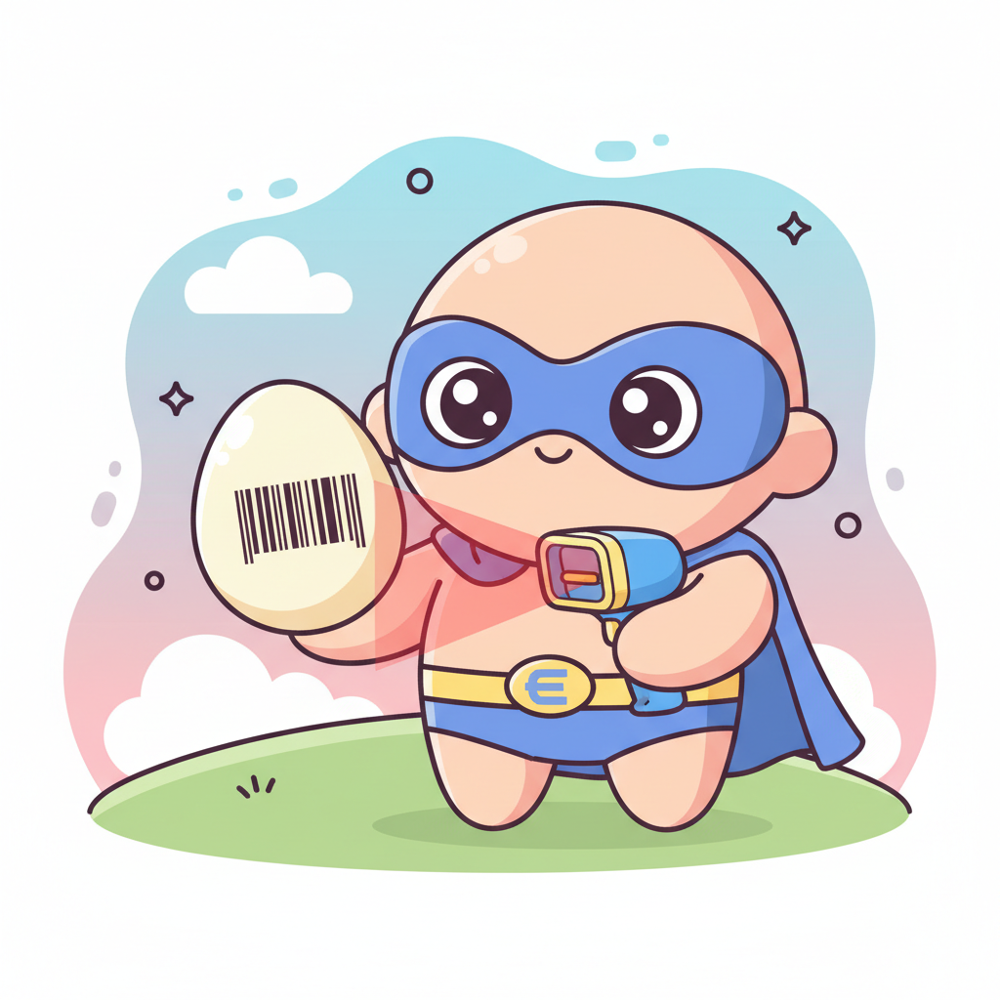

# 雞蛋超人

「雞蛋超人」以手機掃描雞蛋包裝上的 QR 溯源碼並比對政府公告，立即判定該批次是否檢出芬普尼代謝物，讓消費者快速得知安全性並採取相應行動。



## ✨ 主要功能

### 📱 核心掃描功能
- **即時 QR 碼掃描**：使用相機即時掃描 QR 碼
- **智慧比對**：自動與預存條碼進行比對
- **相機控制**：支援前後鏡頭切換、閃光燈控制
- **多媒體提醒**：音效、震動提醒功能

### 🗂️ 條碼管理
- **條碼儲存**：儲存自定義條碼內容、標籤、備註
- **搜尋功能**：快速搜尋條碼內容、標籤、備註
- **編輯操作**：完整的 CRUD 功能（新增、編輯、刪除、複製）
- **預設條碼**：內建衛生福利部食品藥物管理署公布的毒雞蛋條碼

### ⚙️ 設定選項
- **自動比對**：掃描後自動與預存條碼比對
- **音效提醒**：匹配成功時播放音效
- **震動提醒**：匹配成功時震動提示
- **掃描頻率**：可調整掃描敏感度

### 💾 資料管理
- **資料匯出**：將條碼和設定匯出為 JSON 檔案
- **資料匯入**：從 JSON 檔案匯入條碼資料
- **資料重置**：一鍵清除所有資料

## 🚀 快速開始

### 直接使用
1. 下載專案檔案
2. 使用瀏覽器開啟 `index.html`
3. 首次使用時請接受免責聲明

## 📱 使用說明

### 首次使用
1. 開啟應用程式，閱讀並接受免責聲明
2. 系統會自動載入預設衛生福利部食品藥物管理署公布的毒雞蛋條碼
3. 點擊「開始掃描」開始使用

### 掃描流程
1. 點擊「開始掃描」
2. 允許相機權限
3. 將 QR 碼置於掃描框內
4. 系統自動比對並顯示結果

### 條碼管理
1. 點擊「條碼管理」進入管理頁面
2. 使用搜尋框快速找到特定條碼
3. 點擊「新增條碼」或使用「編輯」按鈕修改現有條碼

## 🛠️ 技術架構

### 前端技術
- **HTML5**：結構語義化標籤
- **CSS3**：現代化樣式與響應式設計
- **Vanilla JavaScript**：原生 JavaScript，無框架依賴

### 核心函式庫
- **jsQR**：QR 碼解析核心
- **WebRTC**：相機存取 API
- **Canvas API**：圖像處理
- **Web Audio API**：音效播放

### 資料儲存
- **localStorage**：瀏覽器本地儲存
- **JSON**：資料序列格式

## 📁 專案結構

```
egg-scan/
├── index.html          # 主要 HTML 檔案
├── app.js             # 應用程式邏輯
├── style.css          # 樣式表
├── image.png          # 應用程式圖片
└── README.md          # 專案說明文件
```

## ⚠️ 免責聲明

- **⏳ 資料非即時更新**：系統所提供之資訊可能存在延遲或非最新狀態，請留意更新時效。  
- **📚 僅供教學參考**：本系統內容僅作為教學或參考用途。  
- **⚠️ 免責**：本系統對於掃描結果不承擔任何法律或實務上的責任。  
- **☎️ 查證建議**：如需完整且最新之正確資訊，請以衛生福利部食品藥物管理署（TFDA）之官方公告為準。

## 📄 授權條款

本專案版權所有者（Copyright © [2025] [HKT線上教室]）。

本專案授權任何人以符合下列條件的方式使用、複製、散佈及分享本專案或其中程式碼：
1. 非商業使用：僅允許用於非商業、非營利目的。任何以商業或營利為目的的使用、販售、授權或再散佈均明確禁止。  
2. 保留著作權與聲明：在任何複製或散佈本專案或其衍生作品時，必須保留原始著作權聲明、此授權條款與原始檔案中的所有註記。  
3. 衍生作品：允許製作衍生作品，但衍生作品亦不得用於商業或營利目的，且必須遵循第2條之標示義務。  
4. 免責聲明：本專案按「原樣」提供，未提供任何明示或暗示的保證，包括但不限於對適銷性、特定用途適用性或不侵權的保證。在任何情況下，著作權人或貢獻者不對因使用本專案而導致的任何損害負責。

如需商業授權或有其他使用需求，請聯絡著作權人取得書面許可。  

## 📞 聯絡資訊

如有任何問題或建議，歡迎聯絡：

- **YouTube 頻道**：[HKT線上教室](https://www.youtube.com/@CalvinHuo1004)
- **Thread**：[https://www.threads.com/@calvinhuo1004](https://www.threads.com/@calvinhuo1004)
- **Blog**：[HKT實驗室](https://vocus.cc/salon/hkt-colab)
- **E-mail**：[thishkt@gmail.com](thishkt@gmail.com)
---

⭐ **如果這個專案對您有幫助，請考慮給個 Star！**